# PiWrite V2 - Technical Specification Document

> **AI-Powered Writing Coach for K-6 Students**

---

## Table of Contents
1. [Executive Summary](#executive-summary)
2. [System Architecture](#system-architecture)
3. [AI/ML Components](#aiml-components)
4. [LangGraph Agent Workflows](#langgraph-agent-workflows)
5. [Backend Specification](#backend-specification)
6. [Frontend Specification](#frontend-specification)
7. [Database Schema](#database-schema)
8. [External Services & APIs](#external-services--apis)
9. [Data Flow Diagrams](#data-flow-diagrams)

---

## Executive Summary

PiWrite V2 is an AI-powered educational writing assistant designed for K-6 students. The application guides students through the **5-stage writing process** (Prewriting → Drafting → Revising → Editing → Publishing) using intelligent, adaptive coaching powered by LangGraph agent orchestration.

### Key Capabilities
| Feature | Technology |
|---------|------------|
| AI Coaching | LangGraph + Groq (Llama 3.3 70B) |
| RAG Knowledge Base | Supabase pgvector + SOL Standards |
| Image Generation | HuggingFace Flux.1 Schnell |
| Context Expansion | Tavily Web Search |
| Rich Text Editing | TipTap Editor |
| Database | Supabase (PostgreSQL + Auth) |
| Frontend | Next.js 14 + TypeScript |
| Backend | FastAPI + Python |

---

## System Architecture

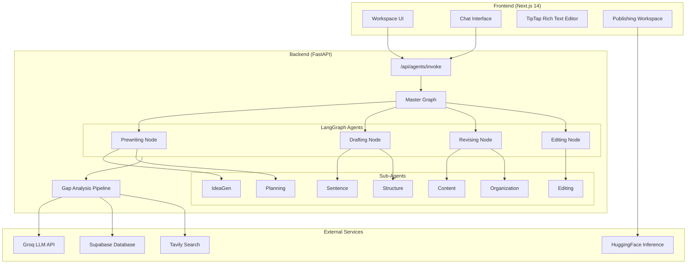

---

## AI/ML Components

### 1. Large Language Model (LLM)

| Property | Value |
|----------|-------|
| **Provider** | Groq |
| **Model** | `llama-3.3-70b-versatile` |
| **Temperature** | 0.7 |
| **Integration** | `langchain_groq.ChatGroq` |

**Configuration**: [llm.py](file:///c:/Users/prasa/Documents/Eshaan/Projects/PiwriteV2/backend/app/core/llm.py)

```python
_llm_instance = ChatGroq(
    api_key=settings.GROQ_API_KEY,
    model="llama-3.3-70b-versatile",
    temperature=0.7,
)
```

---

### 2. Embeddings Model

| Property | Value |
|----------|-------|
| **Provider** | HuggingFace |
| **Model** | `sentence-transformers/all-MiniLM-L6-v2` |
| **Dimension** | 384 |
| **Integration** | `langchain_huggingface.HuggingFaceEmbeddings` |

**Configuration**: [embeddings.py](file:///c:/Users/prasa/Documents/Eshaan/Projects/PiwriteV2/backend/app/rag/embeddings.py)

---

### 3. Image Generation

| Property | Value |
|----------|-------|
| **Provider** | HuggingFace Inference API |
| **Model** | `black-forest-labs/FLUX.1-schnell` |
| **Prompt Refinement** | Groq (Llama 3.3 70B) |
| **Safety Check** | Groq (Llama 4 Maverick 17B Vision) |

**Pipeline**:
1. User prompt → Groq refines into detailed visual description
2. Refined prompt → FLUX.1 generates image
3. Image → Llama 4 Vision verifies child-safety
4. Safe images returned as Base64 data URIs

**Configuration**: [image_generation.py](file:///c:/Users/prasa/Documents/Eshaan/Projects/PiwriteV2/backend/app/services/image_generation.py)

---

### 4. Retrieval-Augmented Generation (RAG)

| Component | Technology |
|-----------|------------|
| **Vector Store** | Supabase pgvector |
| **Embedding Search** | `match_sol_standards` RPC function |
| **Fallback** | Tavily Web Search |
| **Knowledge Base** | Virginia SOL Writing Standards |

**RAG Pipeline**:
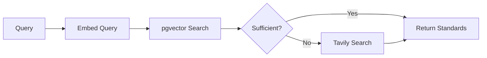

**Configuration**: [retrieval.py](file:///c:/Users/prasa/Documents/Eshaan/Projects/PiwriteV2/backend/app/rag/retrieval.py)

---

## LangGraph Agent Workflows

### Master Graph Architecture

The application uses **LangGraph** for agent orchestration. The master graph routes requests to stage-specific nodes based on the `current_stage` field.

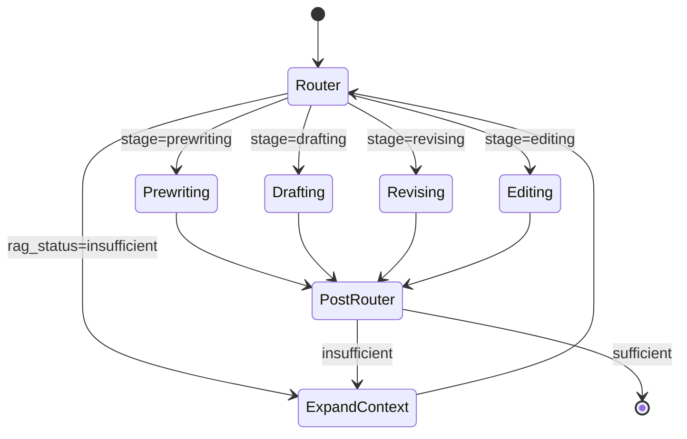

**Configuration**: [master.py](file:///c:/Users/prasa/Documents/Eshaan/Projects/PiwriteV2/backend/app/agents/master.py)

---

### Stage Nodes

Each stage node follows a consistent pattern:

1. **Compute Instructional Gaps** - Analyze student writing against SOL standards
2. **Select Sub-Agent** - Route to appropriate specialist based on top gap
3. **Generate Prompt** - Create coaching response via LLM

---

### Prewriting Stage

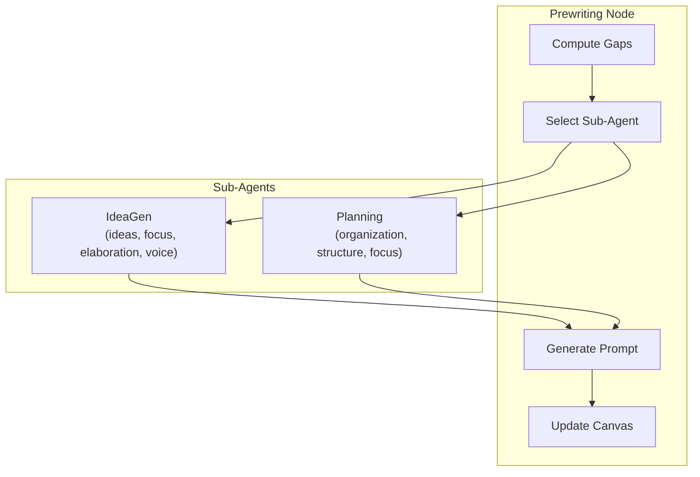

| Sub-Agent | Skill Focus | Purpose |
|-----------|-------------|---------|
| **IdeaGen** | ideas, focus, elaboration, voice | Brainstorm story ideas with student |
| **Planning** | organization, structure, focus | Help organize ideas into Beginning/Middle/End |

**Configuration**: [prewriting.py (subagent)](file:///c:/Users/prasa/Documents/Eshaan/Projects/PiwriteV2/backend/app/agents/subagents/prewriting.py), [prewriting.py (stage)](file:///c:/Users/prasa/Documents/Eshaan/Projects/PiwriteV2/backend/app/agents/stages/prewriting.py)

---

### Drafting Stage

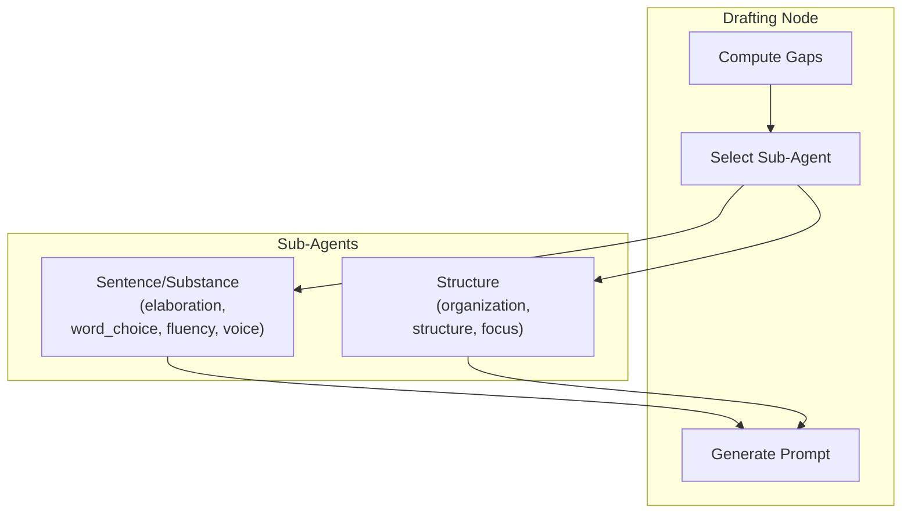

| Sub-Agent | Skill Focus | Purpose |
|-----------|-------------|---------|
| **Sentence** | elaboration, word_choice, sentence_fluency, voice | Add details and substance |
| **Structure** | organization, structure, focus | Help with Beginning/Middle/End structure |

**Configuration**: [drafting.py (subagent)](file:///c:/Users/prasa/Documents/Eshaan/Projects/PiwriteV2/backend/app/agents/subagents/drafting.py), [drafting.py (stage)](file:///c:/Users/prasa/Documents/Eshaan/Projects/PiwriteV2/backend/app/agents/stages/drafting.py)

---

### Revising Stage

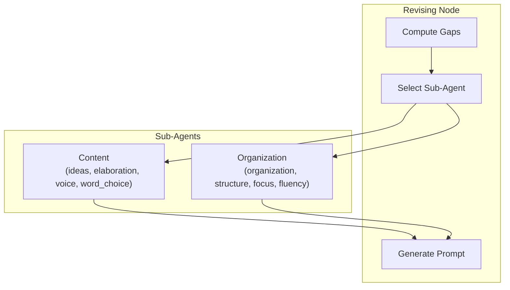

| Sub-Agent | Skill Focus | Purpose |
|-----------|-------------|---------|
| **Content** | ideas, elaboration, voice, word_choice | Strengthen ideas, add "sparkle words" |
| **Organization** | organization, structure, focus, sentence_fluency | Improve flow and transitions |

**Configuration**: [revising.py (subagent)](file:///c:/Users/prasa/Documents/Eshaan/Projects/PiwriteV2/backend/app/agents/subagents/revising.py), [revising.py (stage)](file:///c:/Users/prasa/Documents/Eshaan/Projects/PiwriteV2/backend/app/agents/stages/revising.py)

---

### Editing Stage

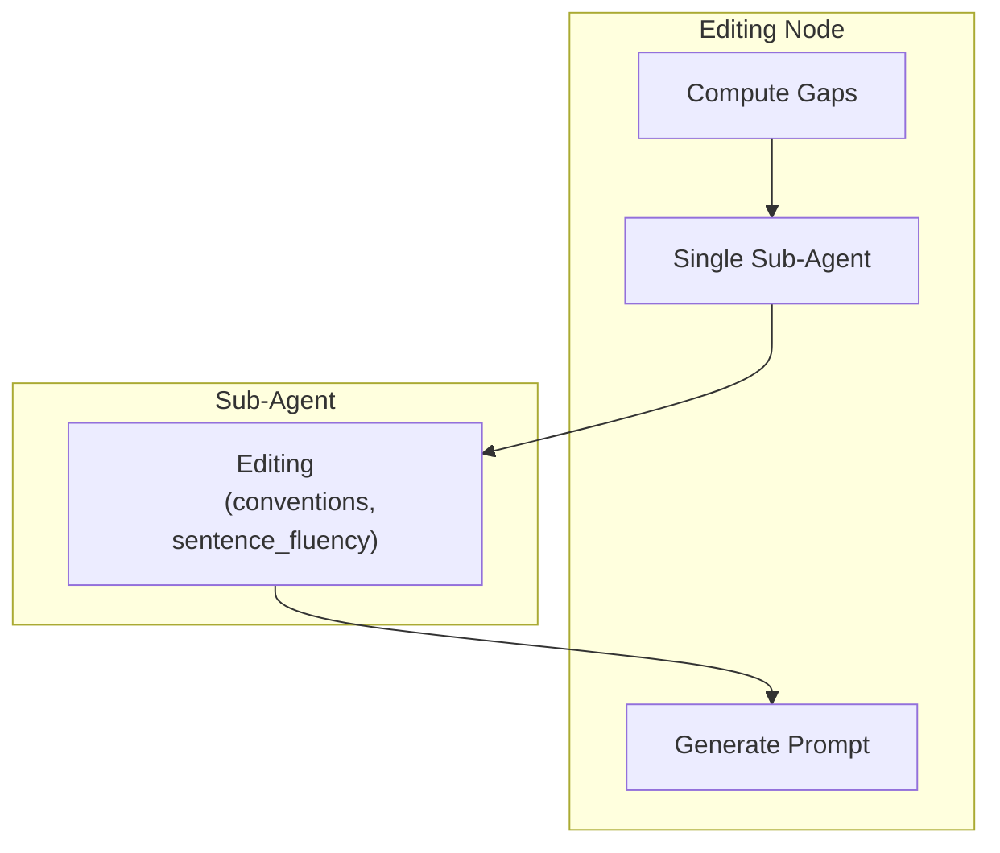

| Sub-Agent | Skill Focus | Purpose |
|-----------|-------------|---------|
| **Editing** | conventions, sentence_fluency | Check spelling, grammar, punctuation |

**Configuration**: [editing.py (subagent)](file:///c:/Users/prasa/Documents/Eshaan/Projects/PiwriteV2/backend/app/agents/subagents/editing.py), [editing.py (stage)](file:///c:/Users/prasa/Documents/Eshaan/Projects/PiwriteV2/backend/app/agents/stages/editing.py)

---

### Gap Analysis Pipeline

The 6-step instructional gap computation is the core AI logic:

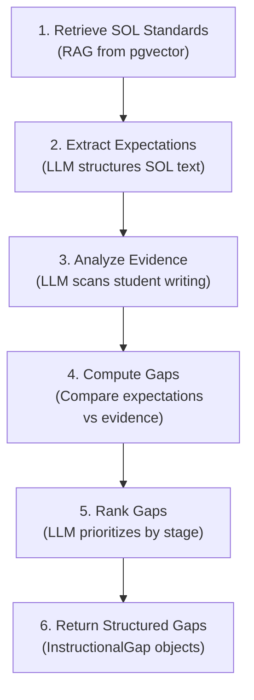

**Configuration**: [gap_analysis.py](file:///c:/Users/prasa/Documents/Eshaan/Projects/PiwriteV2/backend/app/agents/gap_analysis.py)

---

### Context Expansion (RAG Fallback)

When RAG retrieval is insufficient, the system expands context:

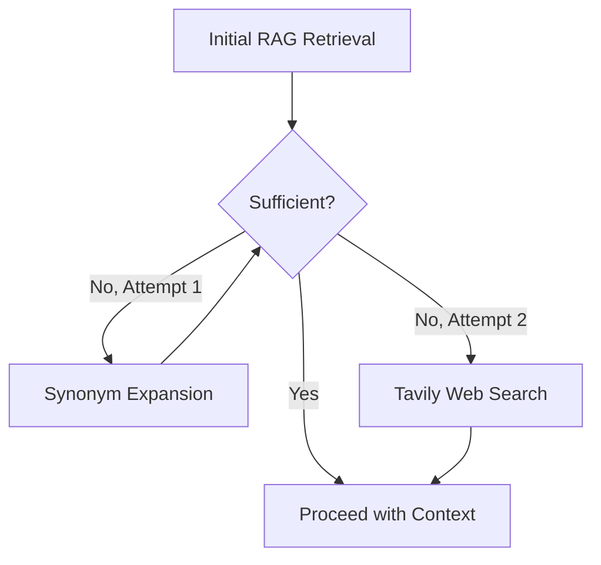

**Configuration**: [master.py:expand_rag_context](file:///c:/Users/prasa/Documents/Eshaan/Projects/PiwriteV2/backend/app/agents/master.py#L11-L75)

---

## Backend Specification

### Framework & Server

| Property | Value |
|----------|-------|
| **Framework** | FastAPI |
| **Server** | Uvicorn |
| **Port** | 8003 (configurable) |
| **Entry Point** | [main.py](file:///c:/Users/prasa/Documents/Eshaan/Projects/PiwriteV2/backend/main.py) |

---

### API Endpoints

#### Agents API (`/api/agents`)

| Endpoint | Method | Description |
|----------|--------|-------------|
| `/invoke` | POST | Invoke LangGraph agent with writing state |
| `/history/{writing_id}` | GET | Fetch chat history for a writing |
| `/analyze` | POST | Analyze writing for instructional gaps |

**Configuration**: [agents.py](file:///c:/Users/prasa/Documents/Eshaan/Projects/PiwriteV2/backend/app/api/agents.py)

---

#### Images API (`/api/images`)

| Endpoint | Method | Description |
|----------|--------|-------------|
| `/generate` | POST | Generate images from text prompt |

**Request Schema**:
```json
{
  "prompt": "A happy bear in a forest",
  "count": 1,
  "type": "illustration",
  "style": "storybook"
}
```

**Configuration**: [images.py](file:///c:/Users/prasa/Documents/Eshaan/Projects/PiwriteV2/backend/app/api/images.py)

---

#### Books API (`/api/books`)

| Endpoint | Method | Description |
|----------|--------|-------------|
| Various | - | Book management endpoints |

**Configuration**: [books.py](file:///c:/Users/prasa/Documents/Eshaan/Projects/PiwriteV2/backend/app/api/books.py)

---

#### Insights API (`/api/insights`)

| Endpoint | Method | Description |
|----------|--------|-------------|
| Various | - | Student progress insights |

**Configuration**: [insights.py](file:///c:/Users/prasa/Documents/Eshaan/Projects/PiwriteV2/backend/app/api/insights.py)

---

### State Models

#### WritingState (LangGraph State)

```python
class WritingState(TypedDict):
    student_id: str
    writing_id: str
    grade_level: str
    current_stage: str  # prewriting, drafting, revising, editing, publishing
    student_text: str
    previous_student_text: Optional[str]
    last_prompt: str
    student_response: str
    retrieved_standards: List[dict]
    instructional_gaps: List[dict]
    next_prompt: Optional[str]
    student_prompts: Annotated[List[str], operator.add]
    sub_agent_used: Optional[str]
    messages: Annotated[List[dict], operator.add]
    rag_status: Literal["pending", "sufficient", "insufficient", "expanded"]
    retrieval_attempts: int
```

**Configuration**: [state.py](file:///c:/Users/prasa/Documents/Eshaan/Projects/PiwriteV2/backend/app/agents/state.py)

---

#### InstructionalGap

```python
class InstructionalGap(BaseModel):
    skill_domain: str  # ideas, organization, voice, word_choice, etc.
    description: str
    sol_reference: Optional[str]
    severity: Literal["low", "medium", "high"]
    evidence: Optional[str]
```

---

#### AgentResponse

```python
class AgentResponse(BaseModel):
    message: str  # Coaching message to student
    suggestions: List[str]  # 3 suggestion chips
    canvas_update: Optional[Union[str, dict, list, Any]]  # Content to add to canvas
```

---

## Frontend Specification

### Framework & Stack

| Property | Value |
|----------|-------|
| **Framework** | Next.js 14 (App Router) |
| **Language** | TypeScript |
| **UI Library** | Radix UI (shadcn/ui components) |
| **Styling** | Tailwind CSS |
| **Rich Text** | TipTap Editor |
| **Database Client** | Supabase JS |

---

### Key Pages

| Route | Component | Description |
|-------|-----------|-------------|
| `/` | `page.tsx` | Landing page |
| `/login` | `login/page.tsx` | Authentication |
| `/dashboard` | `dashboard/page.tsx` | Student dashboard |
| `/workspace/[id]` | `workspace/[id]/page.tsx` | Main writing workspace |
| `/progress` | `progress/page.tsx` | Student progress insights |
| `/profile` | `profile/page.tsx` | User profile |

---

### Workspace Components

| Component | Purpose |
|-----------|---------|
| [page.tsx](file:///c:/Users/prasa/Documents/Eshaan/Projects/PiwriteV2/frontend/app/workspace/%5Bid%5D/page.tsx) | Main workspace orchestration |
| [chat-interface.tsx](file:///c:/Users/prasa/Documents/Eshaan/Projects/PiwriteV2/frontend/components/workspace/chat-interface.tsx) | AI coach chat interface |
| [rich-text-editor.tsx](file:///c:/Users/prasa/Documents/Eshaan/Projects/PiwriteV2/frontend/components/workspace/rich-text-editor.tsx) | TipTap-based rich text editor |
| [stage-stepper.tsx](file:///c:/Users/prasa/Documents/Eshaan/Projects/PiwriteV2/frontend/components/workspace/stage-stepper.tsx) | Writing stage navigation |
| [instructional-gaps.tsx](file:///c:/Users/prasa/Documents/Eshaan/Projects/PiwriteV2/frontend/components/workspace/instructional-gaps.tsx) | Display identified gaps |
| `publishing/` | Publishing stage components |

---

### Publishing Components

| Component | Purpose |
|-----------|---------|
| `publishing-workspace.tsx` | Main publishing layout |
| `book-viewer.tsx` | Book preview component |
| `control-panel.tsx` | Publishing controls |
| `style-controls.tsx` | Styling options |

---

### Key Frontend Features

1. **Debounced Auto-Save** (5s delay)
2. **Idle Agent Check** (30s idle triggers coaching)
3. **Stage Transition Logic** with content preservation
4. **Dynamic Suggestion Chips** from AI
5. **Contextual Highlighting** of text based on AI feedback

---

## Database Schema

### Tables

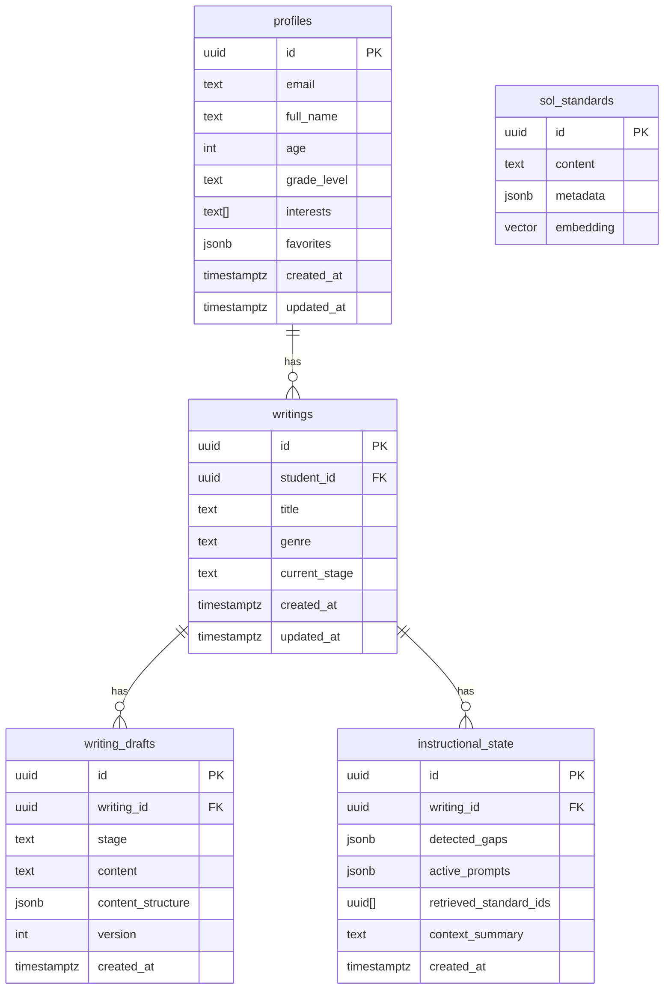

---

### Vector Search Function

```sql
create or replace function match_sol_standards (
  query_embedding vector(384),
  match_threshold float,
  match_count int,
  filter_metadata jsonb default '{}'
) returns table (
  id uuid,
  content text,
  metadata jsonb,
  similarity float
)
```

**Configuration**: [db_schema.sql](file:///c:/Users/prasa/Documents/Eshaan/Projects/PiwriteV2/db_schema.sql)

---

## External Services & APIs

| Service | Purpose | API Key Env Var |
|---------|---------|-----------------|
| **Groq** | LLM inference (Llama 3.3) | `GROQ_API_KEY` |
| **Supabase** | Database, Auth, Vector Store | `SUPABASE_URL`, `SUPABASE_ANON_KEY` |
| **HuggingFace** | Image generation (FLUX.1) | `HF_TOKEN` |
| **Tavily** | Web search fallback | `TAVILY_API_KEY` |
| **LangSmith** | Observability (optional) | `LANGSMITH_API_KEY` |

---

## Data Flow Diagrams

### Complete Agent Invocation Flow

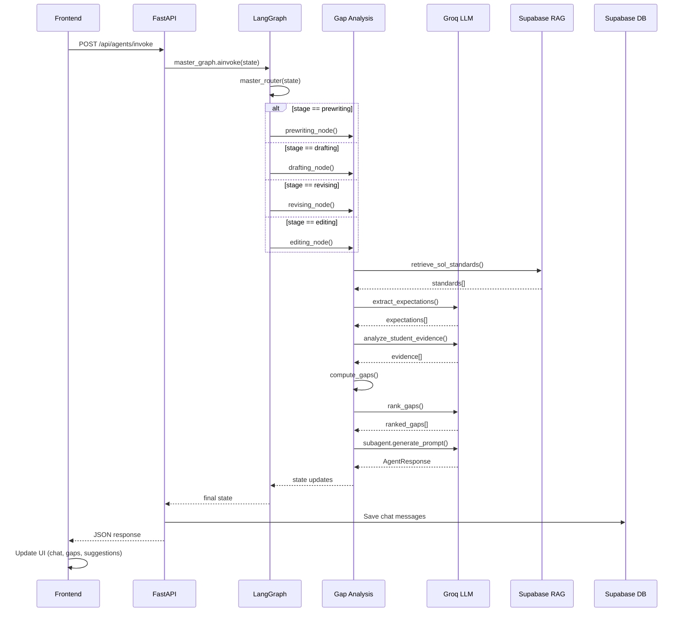

---

### Image Generation Flow

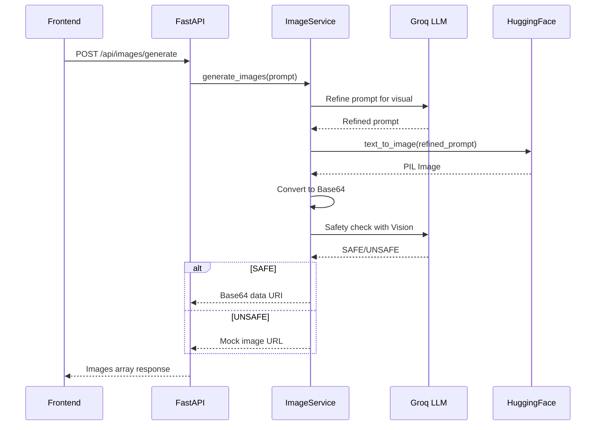

---

## Skill Domains

The system tracks 8 skill domains aligned with writing education standards:

| Domain | Description |
|--------|-------------|
| `ideas` | Generating and developing ideas |
| `organization` | Structure and flow |
| `voice` | Author's voice and audience awareness |
| `word_choice` | Vocabulary and language use |
| `sentence_fluency` | Sentence variety and flow |
| `conventions` | Grammar, spelling, punctuation |
| `focus` | Staying on topic |
| `elaboration` | Adding details and examples |

---

## Environment Variables

### Backend (.env)

```env
GROQ_API_KEY=gsk_...
SUPABASE_URL=https://xxx.supabase.co
SUPABASE_ANON_KEY=eyJ...
HF_TOKEN=hf_...
TAVILY_API_KEY=tvly-...
LANGSMITH_API_KEY=lsv2_... (optional)
LANGCHAIN_PROJECT=piwrite (optional)
MOCK_IMAGES=false
```

### Frontend (.env.local)

```env
NEXT_PUBLIC_SUPABASE_URL=https://xxx.supabase.co
NEXT_PUBLIC_SUPABASE_ANON_KEY=eyJ...
NEXT_PUBLIC_BACKEND_URL=http://localhost:8003
```

---

## Summary

PiWrite V2 is a sophisticated AI-powered writing coach that leverages:

1. **LangGraph** for stateful, multi-stage agent orchestration
2. **8 Specialized Sub-Agents** targeted at specific writing skills
3. **6-Step Gap Analysis Pipeline** for personalized instruction
4. **RAG with Tavily Fallback** for comprehensive educational context
5. **Safe Image Generation** with LLM prompt refinement and safety checks
6. **Real-time Coaching** with debounced saves and proactive feedback

The architecture is designed to be modular, allowing each component to be upgraded independently while maintaining the overall coaching workflow.
